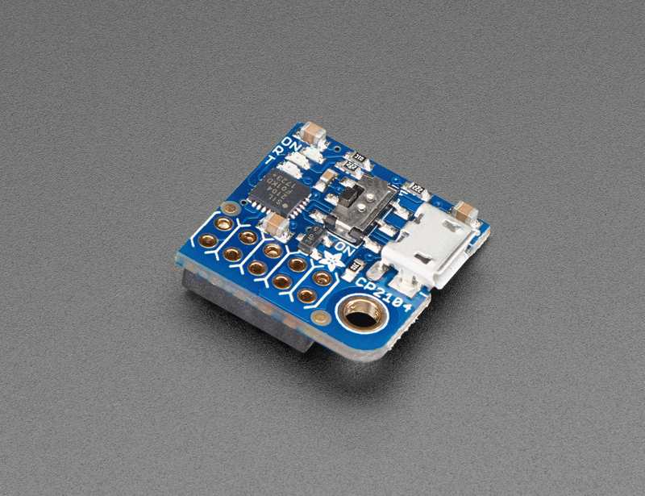
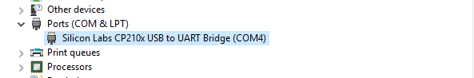
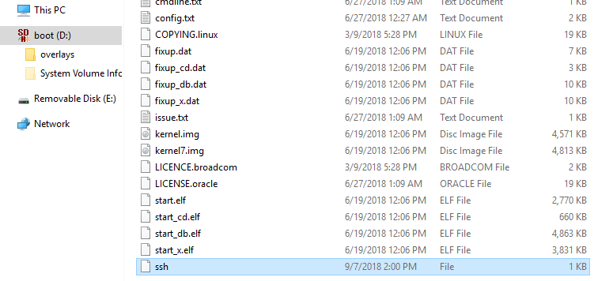
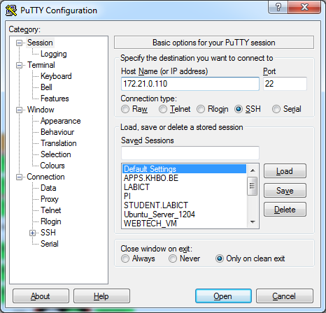
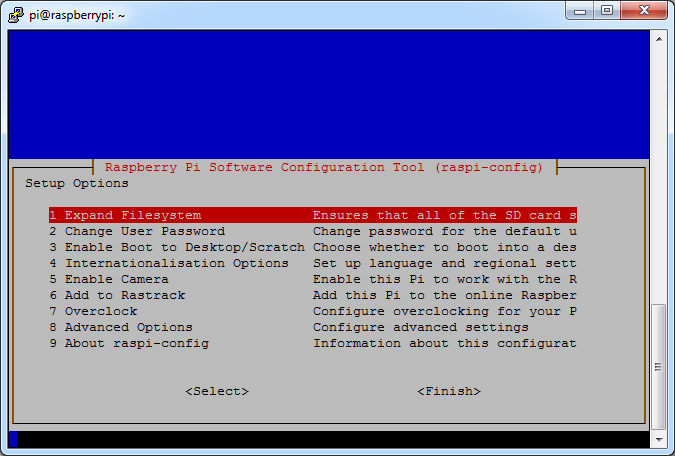

## Connecting to the the Raspberry Pi

Booting the Raspberry Pi is really simple. All you have to do is fit in the SD card and plug in the supply adapter. It automatically boots from the SD card. Interacting with the Linux operating system from that point on can be a bit harder in certain situations.

### Graphical Desktop Environment

If you deployed an OS such as Raspbian than you can attach an HDMI display or RCA Video compatible device (yellow connector on the board). You will also have to connect a USB keyboard to the Pi to be able to control the Pi. Depending on the edition (normal or lite), you will get a graphical desktop environment or a tty terminal.


### UART Connection

An other option that can be used to connect to the Raspberry Pi is using a serial connection. This is often used for debugging embedded systems because it is a very basic connection type. Because of this the kernel will also output its kernel messages (debugging information and errors) to this connection.

Most computers these days lack an external serial interface. Therefore a simple RS232 to USB converter such as the PL-2303HX (see https://www.adafruit.com/datasheets/PL2303HX.pdf for datasheet) can be used. An even easier option is to use the PiUART of AdaFruit [https://www.adafruit.com/product/3589](https://www.adafruit.com/product/3589). This is a simple shield that enables us to connect to the serial terminal of the Raspberry Pi via USB.



Before starting make sure that the power switch of the PiUART is in the **off mode**. This is only for low-power devices such as the Raspberry Pi Zero. The Raspberry Pi 3 needs to be externally powered. Attach the module to the computer and if needed install the driver for the COM device from [https://www.silabs.com/products/development-tools/software/usb-to-uart-bridge-vcp-drivers](https://www.silabs.com/products/development-tools/software/usb-to-uart-bridge-vcp-drivers).



Next the UART needs to be enabled and Bluetooth needs to be disabled. This is because the Bluetooth module is currently connected via the serial port. To configure this open '/boot/config.txt' for editing, and add the lines `enable_uart=1` and `dtoverlay=pi3-disable-bt` to the file. Ensure that the line `enable_uart=0` is not present. This enables the ttyS0 serial port on the GPIO pins 8 and 10. It also disables the Bluetooth module and fixes the Pi 3's problem of the changing baud rates on the port.

```text
# Enable the serial port
enable_uart=1

# Disable bluetooth
dtoverlay=pi3-disable-bt
```


**Disable the serial TTY**

If you wish to disable the serial TTY and not allow logins via this interface you will need to undo the previous steps. To remove the TTY from the serial port you also need to edit `/boot/cmdline.txt` and remove the `console=serial0, 115200` section from the file. Do not split the line when editing, the file must only contain one line. The line should still contain `console=tty1`. This prevents Linux from outputting the boot messages on the serial port, and expecting a log in on the serial port. 


#### Terminal Emulator

Next we need an application such as Putty which has a built in terminal emulator. Just select "serial" as connection type, "COMx" (where x is an integer number) as serial line and "115200" as speed. An example is shown in the figure below. Choose open and you will a get a command line interface similar to the one of SSH.



**Determining the COM device**

You can find the COM port number in the device manager. Select the "Ports (COM & LPT)" category and look for a "Silicon Labs CP210x USB to UART Bridge (COMx)" device.




If you reboot your Raspberry Pi at this moment you will see the kernel messages shown in the next figure mentioned earlier.


Once connected you can then 


### SSH Connection

SSH or Secure SHell is a secure way to connect to a device and execute commands from a distance. In the old days **Telnet** was the way to go but it sends all commands and login information as **clear text**. With **SSH everything is encrypted**. Default SSH daemon listen on port 22.

Raspbian used to come with the SSH daemon enabled by default. However, because of security reasons the SSH daemon is now disabled by default. To enable SSH on a headless setup, a file called `ssh` (without any extension) has to be created onto the boot partition of the SD card. This needs to be done prior to the first time you boot the RPi. Once the SD card has been booted, this approach will not work anymore.



#### The IP Address

The SSH daemon allows us to connect to the Pi from a remote computer using the SSH protocol. Before we can do this we will have to determine the IP address of the Pi.


In case of a home network you can log on to your router and look for the last IP address that was given by your DHCP server running on the router.

Another option can be a network scan tool such as SoftPerfect Network Scanner (can be downloaded from [http://www.softperfect.com/products/networkscanner/](http://www.softperfect.com/products/networkscanner/)) which allows you to scan a range of IP addresses and display some basic information about them such as the MAC (Media Access Control) address and the hostname.

This would not be an option in a LAB if there are 20 Pi's connected to the same subnet all with the default configuration of Raspbian.


This problem can be solved by injecting the rpi-hello script into the Raspbian image. See the last section of this chapter for more info.


Another option is using WireShark and watch the communication on the network. Especially the DHCP traffic which distributes IP addresses to the connected client devices. This way you can also identify what IP address is given to your device (if you know the MAC address of your device).

> #### Note::Wireshark
>
> Wireshark, originally named Ethereal, is a free and open-source packet analyzer. It is used for network troubleshooting, analysis, software and communications protocol development, and education. It can be downloaded from [https://www.wireshark.org](https://www.wireshark.org).

Connecting to a device using the SSH protocol can be easily achieved using a terminal tool such as Putty. All you have to do is start Putty and select the SSH connection option and specify the IP address of the device as shown in Figure 6. Once the connection is configured you can open it.

> #### Note::Putty
>
> PuTTY is a free implementation of Telnet and SSH for Windows and Unix platforms, along with an xterm terminal emulator. It can be downloaded from [http://www.chiark.greenend.org.uk/~sgtatham/putty](http://www.chiark.greenend.org.uk/~sgtatham/putty).



You will be presented with the command line interface (CLI) of the Linux operating system running on your device. The first thing you will see is a login screen similar to the one shown below.


The default username and password can be found on the Raspberry Pi website. For Raspbian it is "pi" as username and "raspberry" as password. Once you login with these credentials you are presented with the command line interface as shown below. From this point on you can start to execute commands on the Pi.


One of the most useful commands you should remember is the `ifconfig` command which displays the current network interfaces and their configuration parameters. If you execute the command you should get a similar output to the one shown in the figure below. Try to identify the IP address and MAC address of the primary Ethernet interface (eth0).


### Checking the Kernel Messages

While the RS232 connection will automatically show the kernel messages while booting, you can also retrieve the output from an SSH connection by using the `dmesg` (display messages) command below:

```shell
$ dmesg
```

This outputs the kernel messages to your current terminal.

When initially booted, a computer system loads its kernel into memory. At this stage device drivers present in the kernel are set up to drive relevant hardware. Such drivers, as well as other elements within the kernel, may produce output ("messages") reporting both the presence of modules and the values of any parameters adopted. (It may be possible to specify boot parameters which control the level of detail in the messages.) The booting process typically happens at a speed where individual messages scroll off the top of the screen before an operator can read/digest them. The dmesg command allows the review of such messages in a controlled manner after the system has started.

Even after the system has fully booted, the kernel may occasionally produce further diagnostic messages. Common examples of when this might happen are when I/O devices encounter errors, or USB devices are hot-plugged.

The output of dmesg can amount to many complete screens. For this reason, this output is normally reviewed using standard text-manipulation tools such as more, tail, less or grep. The output is often captured in a permanent system logfile via a logging daemon, such as syslog.

You can try using the `dmesg` command piped to the `more` command:

```shell
$ dmesg | more
```

You can advance line per line using `ENTER` or block per block by using `SPACEBAR`.

> #### Note::Piping
>
> By using the pipe operator `|`, data can be send from one program to another. What this operator does is feed the output from the program on the left as input to the program on the right.


## Initial Configuration

If you choose to attach an external display to the Pi, then you will already have seen the menu with the initial configuration options shown in the figure below.



If you choose to use the SSH or serial method you will need to run the next command to get this configuration menu.

```shell
$ sudo raspi-config
```

Don't worry too much about how this works. This will be explained in a later chapter. Once you're done configuring the Pi, choose the Finish option and let the Pi reboot.


### Expanding the Filesystem

The first thing we need to do is expand the filesystem. Currently we are using SD cards of 8GB, 16GB or 32GB but the root file system only takes up about 3GB (with more than 80% in use). So to expand the root filesystem to the full SD card we can use the Expand Filesystem configuration script. You will need to reboot the Raspberry Pi to make this available.

### Change User Password

The "Change User Password" tool allows you to change the default password of the pi user. Make sure to do this before continuing. Watch out if you do this using an external keyboard as the keyboard layout may be configured to qwerty. In this case configure the keyboard layout first by selecting the internationalization menu option.

### Enable Boot to Desktop / Scratch

You can change what happens when your Pi boots. Use this option to change your boot preference to command line, desktop, or straight to Scratch (graphical programming). In our case we will be using the command line interface.

### Internationalization Options

This will open up a sub menu with internationalization options to configure.

#### Change Locale

Locales are a framework to switch between multiple languages and allow users to use their language, country, characters, collation order, etc.

In the first screen you will be asked which locales to generate. UTF-8 locales should be chosen by default, particularly for new installations. Other character sets may be useful for backwards compatibility with older systems and software.

Select both `en_US.UTF-8 UTF-8` and `nl_BE.UTF-8 UTF-8`. On the next screen you can pick any of these two to be the default locale.

#### Change Timezone

The time zone should be changed to "Europe – Brussels" to reflect our own time zone.

#### Change Keyboard Layout

This option opens another menu which allows you to select your keyboard layout. It will take a long time to display while it reads all the keyboard types. Changes usually take effect immediately, but may require a reboot.

This option however does not seem to work with the current version of the configuration tool.

You can however change between US and BE keyboard layout by executing one of the following commands the next time you get to the command line interface:

```shell
$ sudo setxkbmap us -variant euro
```

or

```shell
$ sudo setxkbmap be
```

Do take note that this change is only temporarily and will not be remembered once you reboot.

You can get some extra information about the current keyboard layout by issuing the following command:

```shell
setxkbmap -print -verbose 10
```

### Enable Camera

In order to use the Raspberry Pi camera module, you must enable it here. This option will also make sure at least 128MB of RAM is dedicated to the GPU.

### Add to Rastrack

Rastrack is a user-contributed Google Map to which Pi users in the community have added their location; it shows a heat map of where Pi users are known to be around the world. This was set up by young Pi enthusiast Ryan Walmsley in 2012. Rastrack is located at rastrack.co.uk.

Skip this option for the LAB.

### Overclock

It is possible to overclock your Raspberry Pi's CPU. The default is 700MHz but it can be set up to 1000MHz. The overclocking you can achieve will vary; overclocking too high may result in instability.

Selecting this option shows the following warning:
*Be aware that overclocking may reduce the lifetime of your Raspberry Pi. If overclocking at a certain level causes system instability, try a more modest overclock. Hold down 'shift' during boot to temporarily disable overclock.*

For our LABs we will leave the Pi with its default settings.

### Advanced Options

The advanced options allow the configuration of the SSH daemon, the hostname, the division of the memory with the GPU and so on.

#### Overscan

Old TV sets had a significant variation in the size of the picture they produced; some had cabinets that overlapped the screen. TV pictures were therefore given a black border so that none of the picture was lost; this is called overscan. Modern TVs and monitors don't need the border, and the signal doesn't allow for it. If the initial text shown on the screen disappears off the edge, you need to enable overscan to bring the border back.

On some displays, particularly monitors, disabling overscan will make the picture fill the whole screen and correct the resolution. For other displays, it may be necessary to leave overscan enabled and adjust its values.

Any changes will take effect after a reboot.

#### Hostname

Set the visible name for this Pi on a network. Pick a unique name, different from the other students.

#### Memory Split

Change the amount of memory made available to the GPU (Graphics Processing Unit). For the initial LAB exercises you can change this to 16MB.

#### SSH

Enable/disable remote command line access to your Pi using SSH (Secure Shell).

SSH allows you to remotely access the command line of the Raspberry Pi from another computer. Disabling this ensures the SSH service does not start on boot, freeing up processing resources. Note that SSH is enabled by default. If connecting your Pi directly to a public network, you should disable SSH unless you have set up secure passwords for all users.

Make sure to leave this enabled or you will be required to reconfigure your Pi using an external display and keyboard or by using a serial connection.

#### SPI
Enable/disable automatic loading of SPI (Serial Peripheral Interface) kernel module, needed for products such as PiFace.

#### Audio
Force audio out through HDMI or a 3.5mm jack.

#### Update

Update this tool (raspi-config) to the latest version. This requires an active Internet connection.

## Checking the configuration

At this point you should be able to login to the Pi using the pi user with the new password. If you execute the disk free command you should get a similar output to the one shown in the figure below.

```shell
$ df -h
```

> #### Note::Disk Free
>
> `df` stands for disk free and the `–h` option requests a human readable output formatting.

Notice how the disk size has increased and the used disk space percentage has dropped significantly.


Also notice how the hostname of the device changed (HAL  in this case). Rescanning the subnet should result in systems with all different hostnames.

## RPi Hello Injector

As we are booting several Raspberry Pi's inside the LAB on the same subnet, all DHCP enabled, we cannot identify the different devices. All Pi cases could be labeled with their respective MAC-addresses. However if cases get switched it would be very confusing and error-prone. To solve this, the Rpi-Hello script was developed.

This script will run as a service (daemon) in the background and broadcast UDP packet containing a personalized id string and the IP-adress of the Pi. For your convenience the daemon script can be injected into an image file before it is written to the Pi.

To get the script first clone the github repository with the tools and examples that accompany this course:

```shell
cd ; git clone https://github.com/BioBoost/embedded_systems_tools_and_scripts.git
```

Once finished traverse to the subdirectory `embedded_systems_tools_and_scripts/tools/rpi-hello/`. There you will find the README.md file for the rpi-hello injector with instructions on how to use it.

Once finished you can write the new image to an SD-card using Win32Imager or with the following `dd` command:

```shell
sudo dd if=<path_to_altered_image> of=<path_to_sd_card> bs=1M
sudo sync
```

If you are using a virtual machine the command above cannot be used as it is impossible to access the SD-card as a raw device from a virtual machine hosted in VirtualBox. In that case you will need to write the image using the Win32Image application.

Boot the Raspberry Pi and use the following command to capture UDP packets on port 1337:

```shell
sudo ngrep -d <interface> -i "" udp port 1337 and ip broadcast
```

Interface is the name of the ethernet interface in linux and it can be found by using the `ifconfig` command. It's the interface that is connected to the wired network. In previous kernel versions the wired ethernet interfaces were named `eth0`, `eth1`, ... However with newer kernel versions the numbering system got a bit more complex and the interfaces get names like `wlp3s0`.
