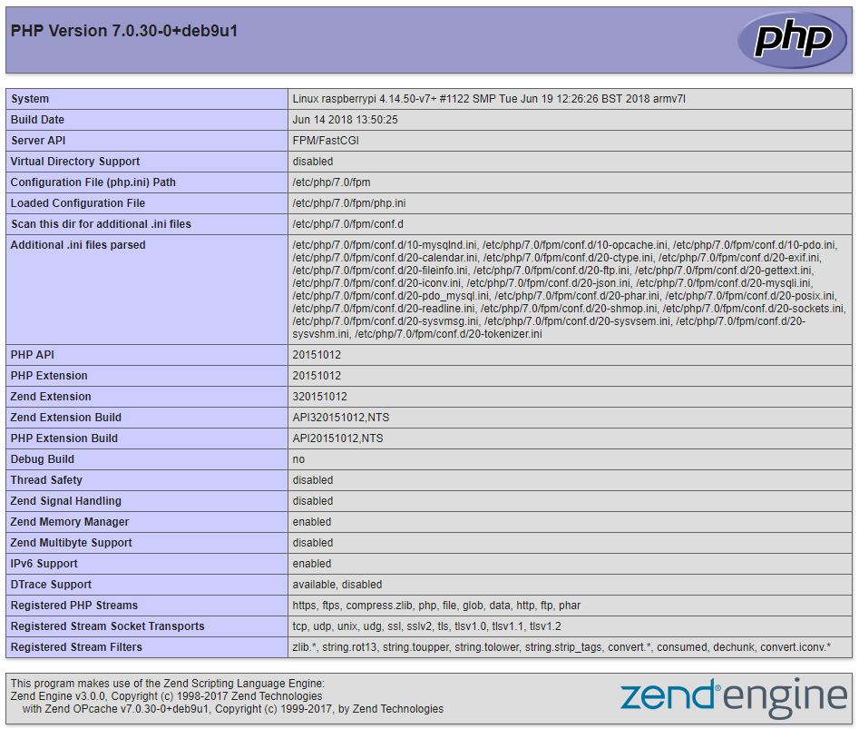

## Challenges

Some of the following challenges can be done in the labs. Others might be consider work for home or preparation for the next session.

### Build an operational Raspbian system

Start by creating an SD card with Raspbian Stretch Lite.

Setup a serial connection with the Raspberry Pi and determine it's MAC and IP address.

Connect to your Raspberry Pi via SSH.

Update the system and change the password of the `pi` user.

Search the Internet on how to change the hostname of the device. Give it a sensible name.

### Static IP Address

Give your Raspberry Pi a static IP address. Search the Internet on how to do this.

Some **points of attention**:
* Ask the lector for IP ranges in the lab's you can use
* Make sure to come to an agreement with the others students in the class.

### Setup a WebServer

<!-- For next year we need to make clear here that the original config should not be deleted or that the example config below should not just be pasted below the original. -->

Setup a webserver on your Raspberry Pi. You can follow this online tutorial: [https://thepi.io/how-to-set-up-a-web-server-on-the-raspberry-pi/](https://thepi.io/how-to-set-up-a-web-server-on-the-raspberry-pi/).

Do make sure to install the packages `php7.0-fpm php7.0-mysql` instead of `php5-fpm php5-mysql`.

Create a file `/var/www/html/index.php` with the following content:

```php
<?php
// Show all information, defaults to INFO_ALL
phpinfo();
?>
```

The result should be:

