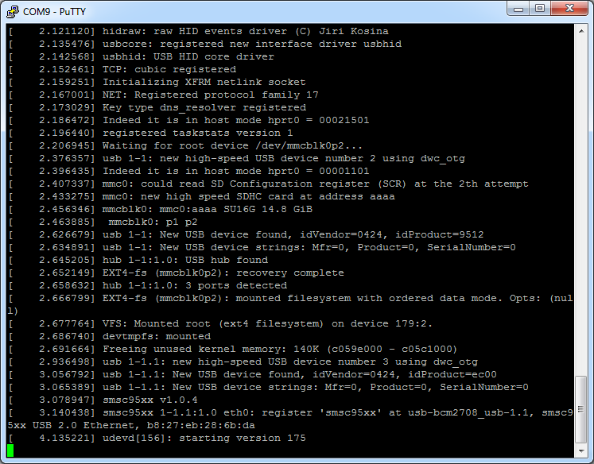

# RPi Operating System

The Raspberry Pi foundation provides several ready to use operating system images for the Pi. At the moment of this writing the following are available:

* Raspbian - The Foundation's official supported operating system (Debian Jessie)
* Ubuntu Mate - Official Ubuntu flavor featuring the MATE desktop
* Snappy Ubuntu Core - A new, transactionally-updated Ubuntu for IoT devices, clouds and more
* OSMC - Open Source Media Centre
* OPENELEC - Open Embedded Linux Entertainment Centre
* PINET - Raspberry Pi Classroom Management Solution
* Windows 10 IoT Core
* RISC OS - A non-Linux distribution

For this course we will be using the Raspbian image. While Ubuntu Mate features a nicer graphical environment it does however not currently offer a headless installation.


**Headless Installation**

A headless machine is a machine without a keyboard, mouse or monitor. This means you need to be able to boot the machine to a state where you can remotely access it to finish the installation/configuration process.


While the instructions further are based on how to equip the Raspberry Pi with Raspbian, they are very similar for most other distributions.

## Creating a bootable SD card

You can download the latest image of Raspbian via the Raspberry Pi website ([https://www.raspberrypi.org/downloads/](https://www.raspberrypi.org/downloads/)). Make sure to pick the "Raspbian Stretch Lite" edition. Extract the compressed file on your local disk (using 7-Zip or a similar tool). You should get an image file (.img extension).

The current Raspbian version at the moment of this writing is of June with a Linux kernel version of 4.14. You can always check out the release notes on [http://downloads.raspberrypi.org/raspbian/release_notes.txt](http://downloads.raspberrypi.org/raspbian/release_notes.txt). The Lite edition of Raspbian is the one without a graphical desktop environment. If you were to attach a display to, all you would see would be a TTY with a login prompt. If you require a GUI, you will need to download the normal image.

To boot the Linux distribution, the image needs to be written to an SD card of at least 4GB. A popular tool to write the an image to an SD card is **Etcher** which can be downloaded at [https://etcher.io/](https://etcher.io/).


**Other host operating systems**

Check out [http://www.raspberrypi.org/documentation/installation/installing-images/README.md](http://www.raspberrypi.org/documentation/installation/installing-images/README.md) for instructions on deploying the image to an SD card when using a different host operating system such as Linux or Mac.


Make sure to select the correct device letter as a target and load the Linux image from your local drive as shown in the image below. If you're ready, hit the flash button and grab a cup of coffee.


Once the write process is finished you can remove the SD card from the computer. Do not plug it into the Raspberry Pi just yet.


**SD Card Backups**

You can also create a backup of your current SD card by reading from the SD card to an image file. For this you will need another tool such as *Win32 Disk Imager*, which can be downloaded at [https://sourceforge.net/projects/win32diskimager](https://sourceforge.net/projects/win32diskimager). Just make sure to select a new image file name. Do take note that the image file will have the size of your SD card. So using an SD card of 32GB will result in a backup image of 32GB. When using MAC or Linux, `dd` can also be used to write and read images to and from the SD card.


## Connecting to the the Raspberry Pi

Booting the Raspberry Pi is really simple. All you have to do is fit in the SD card and plug in the supply adapter. It automatically boots from the SD card. Interacting with the Linux operating system from that point on can be a bit harder in certain situations. Before actually booting the Raspberry Pi, read through this chapter first because some necessary configurations can only be made once and that is before the SD card is used for the first time.

### A Graphical Desktop Environment

If you deployed an OS such as Raspbian than you can attach an HDMI display or RCA Video compatible device (yellow connector on the older Raspberry Pi boards). You will also have to connect a USB keyboard to the RPi to be able to control it. Depending on the operating system and the edition (normal or lite), you will get a graphical desktop environment or a tty terminal.


A tty is a terminal (it stands for teletype - the original terminals used a line printer for output and a keyboard for input). A terminal is basically just a user interface device that uses text for input and output.


### A UART Connection

An other option that can be used to connect to the Raspberry Pi is using a serial connection. This is often used for **debugging embedded systems** because it is a very basic connection type. Because of this the kernel will also output its **kernel messages** (debugging information and errors) to this connection.



Most computers these days lack an external serial interface. Therefore a simple RS232 to USB converter can be used. An example is the PL-2303HX (see https://www.adafruit.com/datasheets/PL2303HX.pdf for datasheet). An even easier option is to use the PiUART of AdaFruit [https://www.adafruit.com/product/3589](https://www.adafruit.com/product/3589).

This device allows a computer to be connected to the Raspberry Pi using a simple USB connection. The PiUART bridges both interfaces and acts as a simple COM device for the computer.


Before starting make sure that the power switch of the PiUART is in the **off mode**. This is only for low-power devices such as the Raspberry Pi Zero. The Raspberry Pi 3 needs to be externally powered. Attach the module to the computer and if needed install the driver for the COM device from [https://www.silabs.com/products/development-tools/software/usb-to-uart-bridge-vcp-drivers](https://www.silabs.com/products/development-tools/software/usb-to-uart-bridge-vcp-drivers).


Next the RPi UART needs to be enabled and Bluetooth module needs to be disabled. This because the Bluetooth module is currently connected via the serial interface. To configure this open `/boot/config.txt` for editing (just plug the SD card back into your computer), and add the lines `enable_uart=1` and `dtoverlay=pi3-disable-bt` to the bottom of the file. Ensure that neither of the lines are already present. This enables the ttyS0 serial port on the GPIO pins 8 and 10. It also disables the Bluetooth module thereby also fixing the Pi 3's problem of the changing baud rates on the port.

```text
# Enable the serial port
enable_uart=1

# Disable bluetooth
dtoverlay=pi3-disable-bt
```


**Disable the serial TTY**

If you wish to disable the serial tty and not allow logins via this interface you will need to undo the previous steps. To remove the tty from the serial port you also need to edit `/boot/cmdline.txt` and remove the `console=serial0,115200` section from the file. Do not split the line when editing, the file must only contain one line. The line should still contain `console=tty1`. This prevents Linux from outputting the boot messages on the serial port, and expecting a log in on the serial port. Disabling tty's on serial interfaces is a good security feature when deploying devices in the fields so the user cannot gain access to the terminal.


#### Terminal Emulator

Next a terminal emulator that supports serial port connections, such as Putty, is required. Just select "serial" as connection type, "COMx" (where x is an integer number) as serial line and "115200" as the speed. An example is shown in the image below. Choose open and you will a get a command line interface.



**Determining the COM device**

You can find the COM port number in the device manager. Select the "Ports (COM & LPT)" category and look for a "Silicon Labs CP210x USB to UART Bridge (COMx)" device. When using a different USB to serial port bridge adapter, the name might differ but it will always show up as a device in that category with a specific COM-port id.


Now connect the shield to the Raspberry Pi, plug in the SD card and the power supply and watch the kernel messages flash by. You will be served a login prompt requesting a username and password. The default username is `pi` and password is `raspberry`.


**Default Logins**

Default logins should always be changed. Remember the news item on a bot network consisting of 100th of thousands of IoT devices. They were all equipped with default usernames and passwords.


Login to the Raspberry Pi using these default credentials and change the password using the Linux `passwd` command.