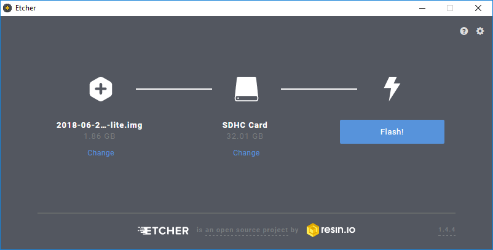

# RPi Operating System

The Raspberry Pi foundation provides several ready to use operating system images for the Pi. At the moment of this writing the following are available:

* Raspbian - The Foundation's official supported operating system (Debian Jessie)
* Ubuntu Mate - Official Ubuntu flavor featuring the MATE desktop
* Snappy Ubuntu Core - A new, transactionally-updated Ubuntu for IoT devices, clouds and more
* OSMC - Open Source Media Centre
* OPENELEC - Open Embedded Linux Entertainment Centre
* PINET - Raspberry Pi Classroom Management Solution
* Windows 10 IoT Core
* RISC OS - A non-Linux distribution

For this course we will be using the Raspbian image. While Ubuntu Mate features a nicer graphical environment it does however not currently offer a headless installation.


**Headless Installation**

A headless machine is a machine without a keyboard, mouse or monitor. This means you need to be able to boot the machine to a state where you can remotely access it to finish the installation/configuration process.


While the instructions further are based on how to equip the Raspberry Pi with Raspbian, they are very similar for most other distributions.

## Creating a bootable SD card

You can download the latest image of Raspbian via the Raspberry Pi website ([https://www.raspberrypi.org/downloads/](https://www.raspberrypi.org/downloads/)). Make sure to pick the "Raspbian Stretch Lite" edition. Extract the compressed file on your local disk (using 7-Zip or a similar tool). You should get an image file (.img extension).

The current Raspbian version at the moment of this writing is of June with a Linux kernel version of 4.14. You can always check out the release notes on [http://downloads.raspberrypi.org/raspbian/release_notes.txt](http://downloads.raspberrypi.org/raspbian/release_notes.txt). The Lite edition of Raspbian is the one without a graphical desktop environment. If you were to attach a display to, all you would see would be a TTY with a login prompt. If you require a GUI, you will need to download the normal image.

To boot the Linux distribution, the image needs to be written to an SD card of at least 4GB. A popular tool to write the an image to an SD card is **Etcher** which can be downloaded at [https://etcher.io/](https://etcher.io/).


**Other host operating systems**

Check out [http://www.raspberrypi.org/documentation/installation/installing-images/README.md](http://www.raspberrypi.org/documentation/installation/installing-images/README.md) for instructions on deploying the image to an SD card when using a different host operating system such as Linux or Mac.


Make sure to select the correct device letter as a target and load the Linux image from your local drive as shown in the image below. If you're ready, hit the flash button and grab a cup of coffee.

Once the write process is finished you can remove the SD card from the computer. Do not plug it into the Raspberry Pi just yet.


**SD Card Backups**

You can also create a backup of your current SD card by reading from the SD card to an image file. For this you will need another tool such as *Win32 Disk Imager*, which can be downloaded at [https://sourceforge.net/projects/win32diskimager](https://sourceforge.net/projects/win32diskimager). Just make sure to select a new image file name. Do take note that the image file will have the size of your SD card. So using an SD card of 32GB will result in a backup image of 32GB. When using MAC or Linux, `dd` can also be used to write and read images to and from the SD card.

