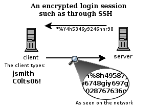
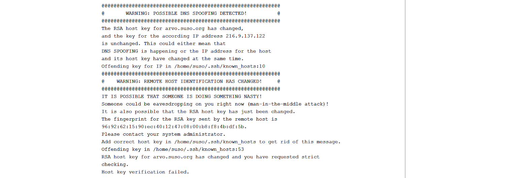

# Secure Shell

There are a couple of ways that you can access a shell (command line) remotely on most Linux/Unix systems. One of the older ways is to use the telnet program, which is available on most network capable operating systems. Accessing a shell account through the telnet method though poses a danger in that everything that you send or receive over that telnet session is visible in plain text on your local network, and the local network of the machine you are connecting to. So anyone who can "sniff" the connection can see your username, password, email that you read, and commands that you run. For these reasons you need a more sophisticated program than telnet to connect to a remote host.


A telnet session can be viewed by anyone on the network by using a sniffing program like Ethereal (now called Wireshark) or tcpdump. It is really rather trivial to do this and so anyone on the network can steal your passwords and other information.

SSH, which is an acronym for Secure SHell, was designed and created to provide the best security when accessing another computer remotely. Not only does it encrypt the session, it also provides better authentication facilities, as well as features like secure file transfer, X session forwarding, port forwarding and more so that you can increase the security of other protocols. It can use different forms of encryption ranging anywhere from 512 bit on up to as high as 32768 bits and includes ciphers like AES (Advanced Encryption Scheme), Triple DES, Blowfish, CAST128 or Arcfour. Of course, the higher the bits, the longer it will take to generate and use keys as well as the longer it will take to pass data over the connection.



The example above shows how the data in an encrypted connection like SSH is encrypted on the network and so cannot be read by anyone who doesn't have the session-negotiated keys, which is just a fancy way of saying the data is scrambled. The server still can read the information, but only after negotiating the encrypted session with the client.

> **HINT** - **Scrambled**
>
> When I say scrambled, I don't mean like the old cable pay channels where you can still kinda see things and hear the sound, I mean really scrambled. Usually encryption means that the data has been changed to such a degree that unless you have the key, its really hard to crack the code with a computer. It will take on the order of years for commonly available computer hardware to crack the encrypted data. The premise being that by the time you could crack it, the data is worthless.

The first thing we'll do is simply connect to a remote machine. This is accomplished by running `ssh <hostname|ip_address>` on your local machine. The hostname or ip address that you supply as an argument is that of the remote machine that you want to connect to. By default ssh will assume that you want to authenticate as the same user you use on your local machine. To override this and use a different user, simply use `<remoteusername>@<hostname|ip_address>` as the argument. Such as in this example:

```shell
$ ssh pi@10.0.0.35
```

The first time around it will ask you if you wish to add the remote host to a list of known_hosts, go ahead and say yes.


It is important to pay attention to this question however because this is one of SSH's major features. Host validation. To put it simply, ssh will check to make sure that you are connecting to the host that you think you are connecting to. That way if someone tries to trick you into logging into their machine instead so that they can sniff your SSH session, you will have some warning, like this:



If you ever get a warning like this, you should stop and determine if there is a reason for the remote server's host key to change (such as if SSH was upgraded or the server itself was upgraded). If there is no good reason for the host key to change, then you should not try to connect to that machine until you have contacted its administrator about the situation. If this is your own machine that you are trying to connect to, you should do some computer forensics to determine if the machine was hacked (yes, Linux can be hacked). You may get this warning if you for example try to connect to the same ip address later but another host is using that ip address. Then the public key and ip address of the machine will not match the saved key and ip. In a classroom this can happen, in that case you need to remove the entry of the machine inside the ~/.ssh/known_hosts file.

After saying yes, it will prompt you for your password on the remote system. If the username that you specified exists and you type in the remote password for it correctly then the system should let you in.


## Generating Keys for SSH

Next we need to generate a public and private key-pair.

The reason why you would generate a keyfile is so that you can increase the security of your SSH session by not using your system password. When you generate a key, you are actually generating two key files. One private key and one public key, which is different from the private key. The private key should always stay on your local computer and you should take care not to lose it or let it fall into the wrong hands. Your public key can be put on the machines you want to connect to in a file called .ssh/authorized_keys. The public key is safe to be viewed by anybody and mathematically cannot be used to derive the private key.

Whenever you connect via ssh to a host that has your public key loaded in the authorized_keys file, it will use a challenge response type of authentication which uses your private key and public key to determine if you should be granted access to that computer. It will ask you for your key passphrase though. But this is your local ssh process that is asking for your passphrase, not the ssh server on the remote side. It is asking to authenticate you according to data in your private key. Using key based authentication instead of system password authentication may not seem like much of a gain at first, but there are other benefits that will be explained later.

To generate a public and private key pair enter the following command:

```shell
$ ssh-keygen -t rsa -C myname@laptop
```

It will prompt you for the location of the keyfile. Unless you have already created a keyfile in the default location, you can accept the default by pressing 'enter'.

Next it will ask you for a passphrase and ask you to confirm it. The idea behind what you should use for a passphrase is different from that of a password. Ideally, you should choose something unique and unguessable, just like your password, but it should probably be something much longer, like a whole sentence. However since we won't be sharing our private keys with anyone you can also leave this empty and just hit 'enter'. This will allow us later on to login to the Raspberry Pi without having to enter a password.

The end result should be something similar to the following screen capture:


If you now traverse to the .ssh dir in your home folder and do an `ls` you should see an `id_rsa` file (your private key) and an `id_rsa.pub` file (the public key).

```shell
$ cd ~/.ssh
$ ls
config  id_dsa  id_dsa.pub  known_hosts
```

## Installing the Public Key

Next the public key needs to be saved on the remote divice, the Raspberry Pi in our case. Login to your RPi as you did before using `<remoteusername>@<hostname|ip_address>`. Now traverse to the `.ssh` directory if you already got one, otherwise create one.

```shell
$ mkdir ~/.ssh && cd ~/.ssh
```

Now open the `authorized_keys` file using nano. If it is already present we will add our new public key, otherwise it will automatically create a new file. Open your public key file on your development machine (can be accomplished using `cat ~/.ssh/id_rsa.pub`) and copy the content. Paste the content in the `authorized_keys` as a new line and save it (CTRL-O to save and CTRL-X te exit).

If you had to create the directory of the file you will need to restrict the permissions of both. This is because SSH is so secure that it requires your authorized_keys to be only readable and writable by the owner of the file. Even the `.ssh` directory cannot be readable or writable by anybody else. To fix this execute the change mode command using the following arguments:

```shell
$ chmod -R 600 ~/.ssh
$ chmod 700 ~/.ssh
```

The commands above will first set all permissions of the directory and files below as readable and writeable for the user. Next the directory itself is also set traversable by the user.

Now you should be able to login to the Raspberry Pi using your private key and without having to enter a password.

## Using Secure Copy

Secure Copy, or scp, allows files to be copied to, from, or between different hosts. It uses ssh for data transfer and provides the same authentication and same level of security as ssh.

The syntax of the scp command is as follows:

```shell
scp [[user1@]host1:]<source> [[user2@]host2:]<destination>
```

### Examples

Copy the file "foobar" from a remote host to the local host

```shell
$ scp <username>@<remotehost>:<path_to_foobar> /some/local/directory
```

Copy the file "foobar" from the local host to a remote host

```shell
$ scp foobar <username>@<remotehost>:<path_to_remote_dir>
```

Copy the directory "foo" from the local host to a remote host's directory "bar"

```shell
$ scp -r foo <username>@<remotehost>:<path_to_remote_dir>
```

Copy the file "foobar.txt" from remote host "remotehost1" to remote host "remotehost2"

```shell
$ scp <username1>@<remotehost1>:/some/remote/directory/foobar.txt <username2>@<remotehost2>:/some/remote/directory/
```

Copying the files "foo.txt" and "bar.txt" from the local host to your home directory on the remote host

```shell
$ scp foo.txt bar.txt <username>@<remotehost>:~
```
