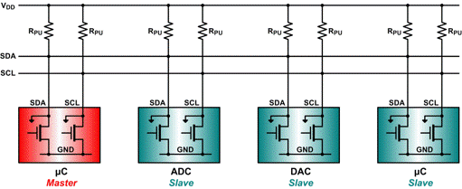

# Communicating using I2C

Why I2C? Because

* Its a common standard
* Its "fast" for low-speed devices
* Bus (multiple devices can be connected)
* Easy to use
* Wide support
* Only 2 communication lines needed (SDA and SCL)
 * SCL is the clock line.
* It is used to synchronize all data transfers over the I2C bus.
 * SDA is the data line.
* The SCL and SDA lines are connected to all devices on the I2C bus
* There does need to be a third wire which is the ground



Both SCL and SDA lines are "open drain" drivers. What this means is that the chip can drive its output low, but it cannot drive it high. For the line to be able to go high you must provide pull-up resistors to Vcc. There should be a resistor from the SCL line to Vcc and another from the SDA line to Vcc. You only need one set of pull-up resistors for the whole I2C bus, not for each device. Vcc depends on the devices used. Typically 5V or 3V3

The devices on the I2C bus are either masters or slaves. The master is always the device that drives the SCL clock line. The slaves are the devices that respond to the master. A slave cannot initiate a transfer over the I2C bus, only a master can do that. There can be, and usually are, multiple slaves on the I2C bus, however there is normally only one master. It is possible to have multiple masters, but it is unusual. Slaves will never initiate a transfer. Both master and slave can transfer data over the I2C bus, but that transfer is always controlled by the master.

Want to know more about I2C, then checkout [https://learn.sparkfun.com/tutorials/i2c](https://learn.sparkfun.com/tutorials/i2c).

## Connecting a Raspberry Pi 3 to an mBed via I2C

Voltage levels should always be checked.

* Raspberry Pi runs at 3.3V
* mBed runs at 3.3V
* So no level shifting is required

Normally I2C requires you to add a pull-up resistor to each line (SDA and SCL). However in the case of connecting an mbed to a Raspberry Pi 3 you will not need to add these. This because the Raspberry Pi 3 already has pull-ups of 1k8 on each i2c line.


For example to connect the Raspberry Pi I2C to the mBed I2C we can use the following connection diagram.


The pinout of all Raspberry Pi models can be found at [https://pinout.xyz/](https://pinout.xyz/).

> **HINT** - **mBed I2C channels**
>
> Note that the mBed has multiple I2C channels. Make sure to use the one that is selected in the firmware.

## I2c-tools

i2c-tools is a useful package that allows us to scan the I2C bus for devices. Very useful for debugging and testing.

> **HINT** - **Enabling i2c on Raspberry Pi**
>
> Make sure to enable the i2c bus on the Raspberry Pi. This can be achieved using the `raspi-config` tool by selecting `Interface Options => I2C => Enable`. You may need to restart the device.

Install the tools using the following command:

```shell
sudo apt update
sudo apt install i2c-tools
```

From now on the `i2cdetect` tool can be used to scan the i2c bus and detect connected slave devices. First check the directory `/dev` for available i2c busses

```shell
cd /dev
ls i2c-*
```

Look for `i2c-x` where x is a number

By using`i2cdetect -r x` and replacing `x` with the number of the actual device bus, the bus can be scanned. For example:

```shell
i2cdetect -r 1
```

You should get output similar to the one shown below if nothing is externally connected.

```text
WARNING! This program can confuse your I2C bus, cause data loss and worse!
I will probe file /dev/i2c-1 using read byte commands.
I will probe address range 0x03-0x77.
Continue? [Y/n]
     0  1  2  3  4  5  6  7  8  9  a  b  c  d  e  f
00:          -- -- -- -- -- -- -- -- -- -- -- -- --
10: -- -- -- -- -- -- -- -- -- -- -- -- -- -- -- --
20: -- -- -- -- -- -- -- -- -- -- -- -- -- -- -- --
30: -- -- -- -- -- -- -- -- -- -- -- -- -- -- -- --
40: -- -- -- -- -- -- -- -- -- -- -- -- -- -- -- --
50: -- -- -- -- -- -- -- -- -- -- -- -- -- -- -- --
60: -- -- -- -- -- -- -- -- -- -- -- -- -- -- -- --
70: -- -- -- -- -- -- -- --
```

Do note that Linux uses 7-bit addresses for I2C (the R/W LSB-bit is dropped off). That is why it seems that only half of the range is scanned.

When you connect the mBed LPC1768 device (mounted on top of an application board) to the Raspberry Pi via I2C you should get the following output when scanning the bus.

```text
WARNING! This program can confuse your I2C bus, cause data loss and worse!
I will probe file /dev/i2c-1 using read byte commands.
I will probe address range 0x03-0x77.
Continue? [Y/n]
     0  1  2  3  4  5  6  7  8  9  a  b  c  d  e  f
00:          -- -- -- -- -- -- -- -- -- -- -- -- --
10: -- -- -- -- -- -- -- -- -- -- -- -- -- -- -- --
20: -- -- -- -- -- -- -- -- -- -- -- -- -- -- -- --
30: -- -- -- -- -- -- -- -- -- -- -- -- -- -- -- --
40: -- -- -- -- -- -- -- -- 48 -- -- -- 4c -- -- --
50: -- -- -- -- -- -- -- -- -- -- -- -- -- -- -- --
60: -- -- -- -- -- -- -- -- -- -- -- -- -- -- -- --
70: -- -- -- -- -- -- -- --
```

The device at address `0x48` is the temperature sensor and the accelerometer has an address of `0x4c`. Both are chips available on the application board. Now turn around the application board and check the addresses that are specified there.