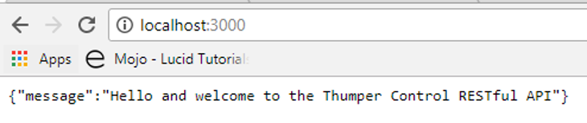
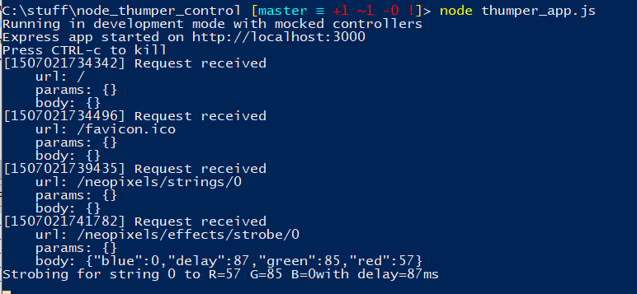

# The Thumper and TouchBerry Project


## The NodeJS REST service on the Thumper

The Thumper can be controlled using it's RESTfull web interface that is hosted on port 3000. The API can be found at [https://github.com/BioBoost/node_thumper_control](https://github.com/BioBoost/node_thumper_control).

This NodeJS app can also run on your local machine so you can develop without the actual Thumper hardware.

### Setting up the NodeJS REST service locally

Clone the application from GitHub:

```shell
git clone https://github.com/BioBoost/node_thumper_control.git
```

Make sure you have python installed (version 2.7 or similar). Also make sure it is added to path (installer checkbox at the bottom in list).

Install node.js on your computer.

Install windows building tools (as administrator)
```shell
npm install --global --production windows-build-tools
```

Traverse in to the git project directory and execute `npm install`.

Run the app using `node thumper_app.js`

Test the connection and setup using chrome or another web browser by surfing to `http://localhost:3000`.



You should also see some debug information being displayed by the NodeJS service itself:



### Advanced REST Client

You can test the REST interface using Chrome and a plugin called "Advanced Rest Client".

## The TouchBerry application

The TouchBerry Pi shield is a shield that can be plugged on top of the Raspberry Pi (2 and 3) and enables a touch interface through 7 capacitive buttons. The shield has the following hardware on board:

* **version 1.0:**
 * AT42QT1070 I2C capacitive touch sensor IC
 * TLC59116 I2C-Bus Constant-Current LED Sink Driver
 * 5 RGB LEDs

* **version 2.0:**
 * AT42QT1070 I2C capacitive touch sensor IC
 * TLC59116 I2C-Bus Constant-Current LED Sink Driver
 * 5 RGB LEDs
 * 24LC65 64K I2C Smart Serial EEPROM
 * MCP9800 2-Wire High-Accuracy Temperature Sensor
 * MMA8451QT MEMS Accelerometer, 3-Axis

You can find the schematic and component list on the project page at CircuitMaker [https://circuitmaker.com/Projects/Details/Sille-Van-Landschoot-2/TouchBerry-Pi](https://circuitmaker.com/Projects/Details/Sille-Van-Landschoot-2/TouchBerry-Pi).

### Assignment Part 1 - TouchBerry Shield Driver

Create a C++ application for the Raspberry Pi that can read the status of the touch sensor (AT42QT1070 which is at address `0x1B`). Make sure you can perform the following actions on the IC:
* Read the vendor ID
* Read the value of the pressed key register (only single pad can be touched at the same time)
* Calibrate the device
* Reset the device

Next extend the application so you can also control the 5 RGB LEDs of the shield (via the TLC59116 I2C LED driver - which is at address `0xC0`). This device is a bit complicated so make sure to read the datasheet. Considerations to make are:
* Make sure to turn the oscillator on
* Make sure that the PWM is enabled
* Write a value to the brightness control registers

Do al of this in a object oriented manner so your code can be easily extended.

Solution for the teacher to this can be found @ [https://github.com/BioBoost/touch_berry_shield_cpp](https://github.com/BioBoost/touch_berry_shield_cpp)

## Sending REST requests

Next the Thumper needs to be controlled via its REST interface. This means we need to be able to send REST requests from our C++ application. While this could be done using a simple HTTP library it is even easier using a library such as "restclient-cpp".

More information about this library can be found at [https://github.com/mrtazz/restclient-cpp](https://github.com/mrtazz/restclient-cpp).

### Dependencies

```shell
sudo apt-get install libcurl4-gnutls-dev
```

### Installing the library

```shell
sudo su
cd /usr/local/src
git clone https://github.com/mrtazz/restclient-cpp.git
./autogen.sh
./configure
make install
```

Checkout `ls /usr/local/lib`. The lib files should be there.

### Assignment Part 2 - REST client

Use the "restclient-cpp" library to send HTTP requests to the thumper. Also make sure to fetch the response back from the thumper. Use the LEDs to display for example the battery state.

#### An extra - JSON

Want to use a handy library for the JSON that needs to be used for the REST requests than checkout [https://github.com/nlohmann/json](https://github.com/nlohmann/json).

It's a header only version so not a lot of work to install it.

```shell
sudo su
cd /usr/local/src
git clone https://github.com/nlohmann/json.git
cp json/src/json.hpp /usr/local/include/
```
