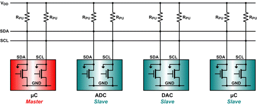
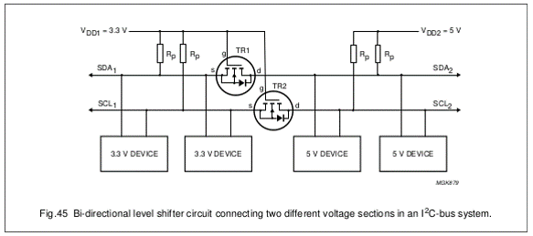
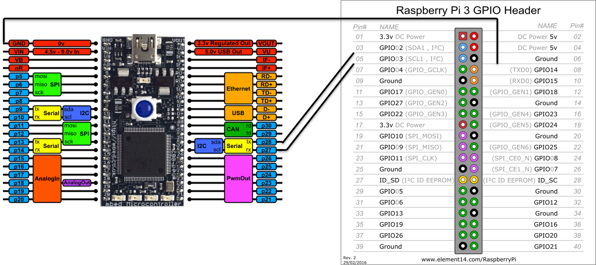
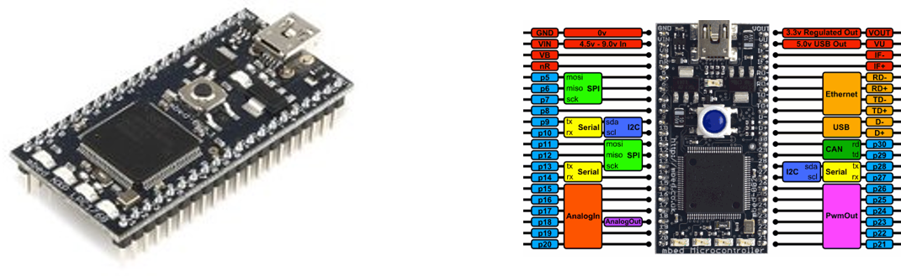
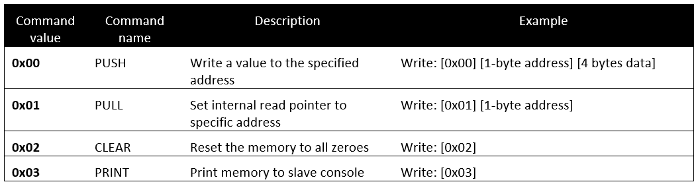

# Communicating using I2C

<!-- Nice tutorial on I2c: https://learn.sparkfun.com/tutorials/i2c -->

Why I2C? Because
* Its a common standard
* Its "fast" for low-speed devices
* Bus (multiple devices can be connected)
* Easy to use
* Wide support
* Only 2 communication lines needed (SDA and SCL)
 * SCL is the clock line.
* It is used to synchronize all data transfers over the I2C bus.
 * SDA is the data line.
* The SCL and SDA lines are connected to all devices on the I2C bus
* There does need to be a third wire which is the ground



Both SCL and SDA lines are "open drain" drivers. What this means is that the chip can drive its output low, but it cannot drive it high. For the line to be able to go high you must provide pull-up resistors to Vcc. There should be a resistor from the SCL line to Vcc and another from the SDA line to Vcc. You only need one set of pull-up resistors for the whole I2C bus, not for each device. Vcc depends on the devices used. Typically 5V or 3V3

The devices on the I2C bus are either masters or slaves. The master is always the device that drives the SCL clock line. The slaves are the devices that respond to the master. A slave cannot initiate a transfer over the I2C bus, only a master can do that. There can be, and usually are, multiple slaves on the I2C bus, however there is normally only one master. It is possible to have multiple masters, but it is unusual. Slaves will never initiate a transfer. Both master and slave can transfer data over the I2C bus, but that transfer is always controlled by the master.


## Connecting a Raspberry Pi 3 to an mbed via I2C

Voltage levels should always be checked.

* Raspberry Pi runs at 3.3V
* mbed runs at 3.3V
* So no level shifting is required

Normally I2C requires you to add a pull-up resistor to each line (SDA and SCL). However in the case of connecting an mbed to a Raspberry Pi 3 you will not need to add these. This because the Raspberry Pi 3 already has pull-ups of 1k8 on each i2c line.



For example to connect the Raspberry Pi I2C to the mbed I2C we can use the following connection diagram.



> #### Info::mbed I2C channels
>
> Note that the mbed has multiple I2C channels. Make sure to use the one that is selected in the firmware.

## mbed I2C Memory Slave

The I2C Memory Slave emulates a really small I2C memory device. It allows you to store 32 integers (of 4 bytes) each and retrieve them.



To connect to the device you will need to attach an I2C master device to pin 27 (SCL) and pin 28 (SDA).

To get some console output from the slave device you can use a terminal program such as Putty to connect to the serial interface over USB at a speed of 115200 baud.

The slave device also has an alive LED which will blink periodically as long as the device is operational and responsive.

The I2C bus operates at 100kHz and the slave device address is 0x24.

> #### Warning::7-bit versus 8-bit addressing
>
> Caution because mBed uses 8-bit I2C addresses while Linux uses 7-bit. You will need to use the 7-bit address in you C++ program !

The following overview shows the commands that can be send to the slave device.



With the **PUSH** command you can write a value to the memory device. All you need to do is send 6 bytes to the device. The command byte, followed by the address of where the value should be stored and last the actual integer value consisting of 4 bytes.

The **PULL** command allows you to set the internal read pointer of the slave. This pointer is used when reading from the device and should point to the memory location you want to read. Once set you can do a read from the slave device, which will send you 5 bytes. The first byte is the address of the internal read pointer. The following 4 bytes are the actual value stored in the memory at the given address.

The **CLEAR** and **PRINT** commands are simple 1-byte commands which can be send to the device to respectively clear the memory and to print the content of the memory to the slave's console.

Get the firmware for the slave device from this GitHub repository [https://github.com/BioBoost/iot_devices_i2c_memory_slave](https://github.com/BioBoost/iot_devices_i2c_memory_slave).

Clone it using git and deploy it using the offline mbed-CLI. Connect to the device (115200 baud) using putty or another terminal client to see some debugging information.

## I2c-tools

i2c-tools is a useful package that allows us to scan the I2C bus for devices. Very useful for debugging and testing.

> #### Warning::Enable i2c on Raspberry Pi
>
> Make sure to enable the i2c bus on the Raspberry Pi. This can be achieved using the `raspi-config` tool. You may need to restart the device.

Install the tools using the following command:

```shell
sudo apt-get install i2c-tools
```

Once the two embedded boards are connected using i2c you can use the i2cdetect tool to scan the bus for slave devices. For this we need to check `/dev` for available i2c busses

```shell
cd /dev
ls i2c-*
```

Look for `i2c-x` where x is a number

Use the i2cdetect tool to scan the bus `i2cdetect -r x` and replace `x` with the number of the actual device bus. For example:

```shell
i2cdetect -r 1
```
You should get output similar to the one shown below

```text
# i2cdetect -r 1
WARNING! This program can confuse your I2C bus, cause data loss and worse!
I will probe file /dev/i2c-1 using read byte commands.
I will probe address range 0x03-0x77.
Continue? [Y/n]
     0  1  2  3  4  5  6  7  8  9  a  b  c  d  e  f
00:          -- -- -- -- -- -- -- -- -- -- -- -- --
10: -- -- 12 -- -- -- -- -- -- -- -- -- -- -- -- --
20: -- -- -- -- -- -- -- -- -- -- -- -- -- -- -- --
30: -- -- -- -- -- -- -- -- -- -- -- -- -- -- -- --
40: -- -- -- -- -- -- -- -- 48 -- -- -- 4c -- -- --
50: -- -- -- -- -- -- -- -- -- -- -- -- -- -- -- --
60: -- -- -- -- -- -- -- -- -- -- -- -- -- -- -- --
70: -- -- -- -- -- -- -- --
```

Notice that i2cdetect (and Linux) sees the device at 0x12 instead of 0x24. This is normal as Linux uses a 7bit address and mbed an 8bit address.

## Assignment

Write a user space application (diagnostic) and let it communicate with the slave device. You will need to cross-compile the source to the ARM architecture

In this setup the Raspberry Pi will act as a master while the mbed memory emulator is the slave.

Start from [https://elinux.org/Interfacing_with_I2C_Devices](https://elinux.org/Interfacing_with_I2C_Devices)
