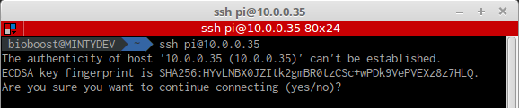
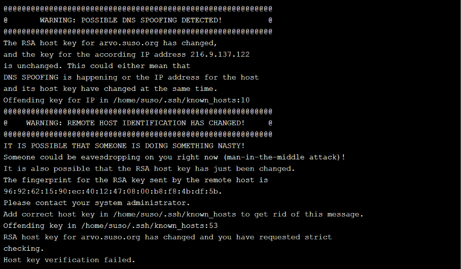
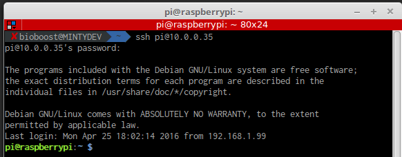

<!-- toc -->

# Connecting to the Rpi

## Using SSH

There are a couple of ways that you can access a shell (command line) remotely on most Linux/Unix systems. One of the older ways is to use the telnet program, which is available on most network capable operating systems. Accessing a shell account through the telnet method though poses a danger in that everything that you send or receive over that telnet session is visible in plain text on your local network, and the local network of the machine you are connecting to. So anyone who can "sniff" the connection can see your username, password, email that you read, and commands that you run. For these reasons you need a more sophisticated program than telnet to connect to a remote host.


A telnet session can be viewed by anyone on the network by using a sniffing program like Ethereal (now called Wireshark) or tcpdump. It is really rather trivial to do this and so anyone on the network can steal your passwords and other information.

SSH, which is an acronym for Secure SHell, was designed and created to provide the best security when accessing another computer remotely. Not only does it encrypt the session, it also provides better authentication facilities, as well as features like secure file transfer, X session forwarding, port forwarding and more so that you can increase the security of other protocols. It can use different forms of encryption ranging anywhere from 512 bit on up to as high as 32768 bits and includes ciphers like AES (Advanced Encryption Scheme), Triple DES, Blowfish, CAST128 or Arcfour. Of course, the higher the bits, the longer it will take to generate and use keys as well as the longer it will take to pass data over the connection.


The example above shows how the data in an encrypted connection like SSH is encrypted on the network and so cannot be read by anyone who doesn't have the session-negotiated keys, which is just a fancy way of saying the data is scrambled. The server still can read the information, but only after negotiating the encrypted session with the client.

> #### Note::Scrambled
>
> When I say scrambled, I don't mean like the old cable pay channels where you can still kinda see things and hear the sound, I mean really scrambled. Usually encryption means that the data has been changed to such a degree that unless you have the key, its really hard to crack the code with a computer. It will take on the order of years for commonly available computer hardware to crack the encrypted data. The premise being that by the time you could crack it, the data is worthless.

The first thing we'll do is simply connect to a remote machine. This is accomplished by running `ssh <hostname|ip_address>` on your local machine. The hostname or ip address that you supply as an argument is that of the remote machine that you want to connect to. By default ssh will assume that you want to authenticate as the same user you use on your local machine. To override this and use a different user, simply use `<remoteusername>@<hostname|ip_address>` as the argument. Such as in this example:

```shell
ssh pi@10.0.0.35
```

The first time around it will ask you if you wish to add the remote host to a list of known_hosts, go ahead and say yes.


It is important to pay attention to this question however because this is one of SSH's major features. Host validation. To put it simply, ssh will check to make sure that you are connecting to the host that you think you are connecting to. That way if someone tries to trick you into logging into their machine instead so that they can sniff your SSH session, you will have some warning, like this:



If you ever get a warning like this, you should stop and determine if there is a reason for the remote server's host key to change (such as if SSH was upgraded or the server itself was upgraded). If there is no good reason for the host key to change, then you should not try to connect to that machine until you have contacted its administrator about the situation. If this is your own machine that you are trying to connect to, you should do some computer forensics to determine if the machine was hacked (yes, Linux can be hacked). You may get this warning if you for example try to connect to the same ip address later but another host is using that ip address. Then the public key and ip address of the machine will not match the saved key and ip. In a classroom this can happen, in that case you need to remove the entry of the machine inside the ~/.ssh/known_hosts file.

After saying yes, it will prompt you for your password on the remote system. If the username that you specified exists and you type in the remote password for it correctly then the system should let you in.


