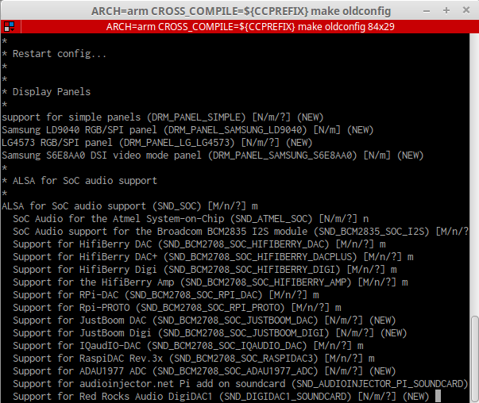
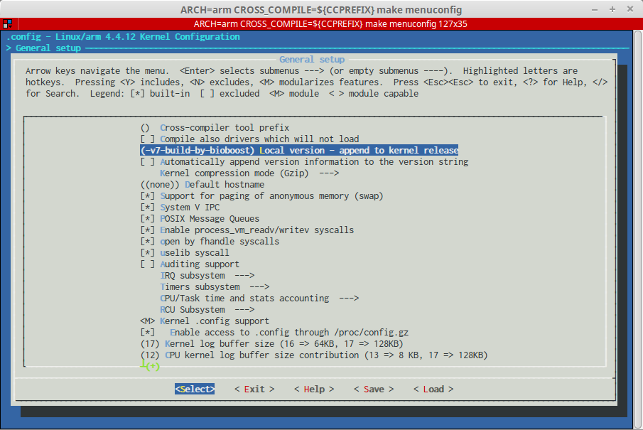

<!-- toc -->

# Compiling the RPi Kernel

There are several reasons why one would want to compile a Linux kernel:

* First you might want to upgrade your current Linux kernel to a newer version. You can then download the sources and compile the newer version.

* Ofcourse if you want to add features to the kernel or change something you will also need to compile the full kernel to be able to test it out.

* Another reason would be the need for the build context of the kernel when developing loadable kernel modules.

This course mainly needs a new compiled kernel for its build context to allow the building of loadable kernel modules. Ofcourse it's also a nice challenge to build a Linux kernel for an embedded system.

There are two main methods for building the kernel. You can build it nativally on a Raspberry Pi which is fairly easy but will take a long time; or you can cross-compile, which is much quicker, but requires more setup.

## Cross-compiling the Kernel

Since we need the kernel for its build context we need to fetch the source code of the kernel version that is currently running on the Raspberry Pi. Once we fetch the source, we need to install a cross-compiler as we are developing and compiling on an x86/AMD64 system but need to kernel to run on an ARM architecture.

Before the compilation process can be started we need to configure the source for the Raspberry Pi 2. This is done by the means of a config file which contains all the settings of the kernel and build system. This file can be generated by the Linux system running on the Raspberry Pi.

Next the compilation can be started and once finished the new kernel can be deployed and tested.

### Current Kernel Version

To build loadable kernel modules, you must have a prebuilt kernel available that contains the configuration and header files used in the build. Also, the kernel must have been built with modules enabled.

This also implies that we need the same or a close to the current kernel version to build. If not the same rather take a newer than older version. Mainly because newer kernel versions will be backward compatible. Older versions may lack newer system_calls or functionality.

To determine the current kernel version running on your Raspberry Pi 2, execute the `uname` command to print out some system information, including the kernel version.

```shell
uname -a
Linux rasp-embedded 4.4.12-v7+ #1 SMP Fri Jun 3 13:15:55 CEST 2016 armv7l GNU/Linux
```

In the example above the system is running a kernel with version '4.4.12'.

### Getting the kernel source

The kernel sources for the modified Raspberry Pi linux kernel can be found at
[https://github.com/raspberrypi/linux](https://github.com/raspberrypi/linux).

Find the kernel version between the branches that is running on your Pi.

To save some time and place its best to clone a shallow copy of the repository using the following command:

```shell
cd && git clone --depth 1 -b rpi-4.4.y https://github.com/raspberrypi/linux.git rpi-linux
```

> #### Note::Cloning a branch
>
> When cloning a repository you clone all remote branches and all history.
> This can take up a lot of space and time with a huge repository.
> By using the `-b <branchname>` argument it is possible to only clone a specific remote branch.
> By providing an argument of `--depth 1` to the clone command, the clone process will copy only the latest revision of everything in the repository instead of every single revision of every single file in history. You can check this by doing a `git log` inside the clone.


This will take a few minutes after which a directory `rpi-linux` should have been created in your home dir.

### Cross-compiler

Next we need to setup the cross-compiler so we can use our development machine to build programs for an ARM architecture.

Luckely a cross-compiler is readily available. All we need to do is clone it.

```shell
cd && git clone --depth 1 https://github.com/raspberrypi/tools.git rpi-tools
```

This will clone the required tools in your home directory.


Now if we want to cross-compile something we will need to provide the path to the cross-compiler. You can try to do it manually inside a terminal by exporting the path to the compiler. Do take note that if you close the terminal the path will be forgotten. So you will need to redo the export. Also do not forget to substitute `<username>` with the username of your account on your development machine.

```shell
export CCPREFIX=/home/<username>/rpi-tools/arm-bcm2708/gcc-linaro-arm-linux-gnueabihf-raspbian/bin/arm-linux-gnueabihf-
```

Make sure not to make any typo's and use tab-completion !

On the other hand to you can also create a small script to this for you. First create a shell script. Add a shebang and the export command to it using nano. 

```shell
cd && nano setup_cross_compiler.sh
```

Add the following:

```shell
#!/bin/sh
export CCPREFIX=/home/<username>/rpi-tools/arm-bcm2708/gcc-linaro-arm-linux-gnueabihf-raspbian/bin/arm-linux-gnueabihf-
```

Or even better using the `whoami` command:

```shell
#!/bin/sh
export CCPREFIX=/home/$(whoami)/rpi-tools/arm-bcm2708/gcc-linaro-arm-linux-gnueabihf-raspbian/bin/arm-linux-gnueabihf-
```

Save the script, make it executable and run it. Do take note that you need to use the `source` command to run the script otherwise it will be run in another shell and the export will be lost.

```shell
chmod u+x setup_cross_compiler.sh
source ./setup_cross_compiler.sh
```

!!! warning "Closing the terminal"
	Again note that if you close the terminal, the export will also be lost.

Make sure to check if all went well by echoing: `echo $CCPREFIX`. You should get the following result:

```shell
echo $CCPREFIX
/home/bioboost/rpi-tools/arm-bcm2708/gcc-linaro-arm-linux-gnueabihf-raspbian/bin/arm-linux-gnueabihf-
```

Don't want to do this every time ? Then add the following lines to the bottom of `~/.zshrc` or `./bashrc` to make the export on every login or shell launch:

```shell
# Cross-compiler for RPI
export CCPREFIX=$HOME/rpi-tools/arm-bcm2708/gcc-linaro-arm-linux-gnueabihf-raspbian/bin/arm-linux-gnueabihf-
```

### Configuring the Kernel

While we could configure the kernel ourselves, it would save us several days if the configuration of the kernel that is currently running on the Raspberry Pi can be used. Luckely it can.

For this you will need to login to the Raspberry Pi using ssh:

```shell
ssh pi@<ip-address>
```

The current config can be generated by using the following commands

```shell
sudo modprobe configs
```

This will generate the file `/proc/configs.gz`. By extracting the file we get the actual textual config file.

```shell
cd /tmp
cp /proc/config.gz .
gunzip config.gz
```

> #### Note::Kernel Config
>
> Go ahead and take a look inside the kernel config file. You can do this with the `cat /tmp/config` command.
> If you wish to know the speed at which the I2C bus is configured try executing the command `cat /tmp/config | grep CONFIG_I2C_BCM2708_BAUDRATE`


Now you can go back to your development machine and copy the config into the linux source tree using secure copy.

```shell
cd ~/rpi-linux
scp pi@<ip-address>:/tmp/config ./.config
```

Note how the destination file start with a '.' and is thereby a hidden file.

Because chances are that the version of the kernel source we checked out is newer than the version running on the Pi, it is necessary to check the config file for new options. This is done executing a `make oldconfig`.

```shell
ARCH=arm CROSS_COMPILE=${CCPREFIX} make oldconfig
```

Note how we need to provide the actual architecture (ARM in this case) and the path to the cross-compiler.




You will be presented with a list of new options available in the newer kernel as shown in the image above. You should be careful what options to enable or disable. However in most cases you can just press ENTER to pick the default option.

It is also possible to change the kernel configuration through a graphical interface. Execute the following command to show the menuconfig:

```shell
ARCH=arm CROSS_COMPILE=${CCPREFIX} make menuconfig
```

Let's try to change something arbitrary like the 'local version string' which shows when using the `uname` command. Traverse to `General setup => Local version - append to kernel release` and change it to a custom string. An example is shown in the figure below. Make sure to save and exit before proceeding.

> #### Warning::Local Version String
>
> Do not use special characters or spaces for the local version string of the linux kernel as it will be integrated in the modules path build later in this course. A good example is 'v7-build-by-mark'; a bad one is 'v7 [build by m@rk]'




### Building the kernel and modules

To build the kernel, the modules and device trees (more on this later) the following commands can be used:

```shell
ARCH=arm CROSS_COMPILE=${CCPREFIX} make zImage modules dtbs
ARCH=arm CROSS_COMPILE=${CCPREFIX} make INSTALL_MOD_PATH=/tmp/modules modules_install
scripts/mkknlimg arch/arm/boot/zImage /tmp/kernel7.img
```

> #### Note::Threads
>
> `-j#` sets the number of threads that should be used to build the kernel. It should be set to 1.5* the number of cores in your CPU. So if you have 4 cores, you should set it to 6. On a VM you can omit the argument unless you used more than 1 core.

Next we need to make a package containing all the build modules. If a dedicated machine were to be used this step would be simpler as we could deploy the modules directly to the SD card. However with Virtual Box it is not possible to directly access an SD card.

```shell
cd /tmp/modules
tar czf modules.tgz *
scp /tmp/modules/modules.tgz pi@<ip-address>:/tmp
```

Next we need the kernel image and the device tree blobs to be copied to the Raspberry Pi:

```shell
mkdir -p /tmp/boot/overlays

mv /tmp/kernel7.img /tmp/boot/kernel7.img

cp /home/$(whoami)/rpi-linux/arch/arm/boot/dts/*.dtb /tmp/boot/
cp /home/$(whoami)/rpi-linux/arch/arm/boot/dts/overlays/*.dtb* /tmp/boot/overlays
cp /home/$(whoami)/rpi-linux/arch/arm/boot/dts/overlays/README /tmp/boot/overlays

scp -r /tmp/boot pi@<ip-address>:/tmp
```

Now login to the Pi do deploy the new kernel:

```shell
ssh pi@<ip-address>
sudo cp /boot/kernel7.img /boot/kernel7.img.old
cd / && sudo tar xzf /tmp/modules.tgz
sudo cp -r /tmp/boot/* /boot
```

This should be it. Restart the Raspberry Pi and keep you fingers crossed it shows back up.

If all went well the new kernel should be operational. Check using `uname`:

```shell
ssh pi@<ip-address>
uname -a
Linux rasp-embedded 4.4.12-v7-build-by-bioboost+ #2 SMP Tue Jun 7 14:32:57 CEST 2016 armv7l GNU/Linux
```

Make sure not to delete any files on your development machine as they will be needed for compiling the loadable kernel modules. Maybe now is a good time to create a snapshot of the VM.